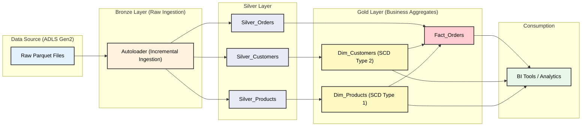
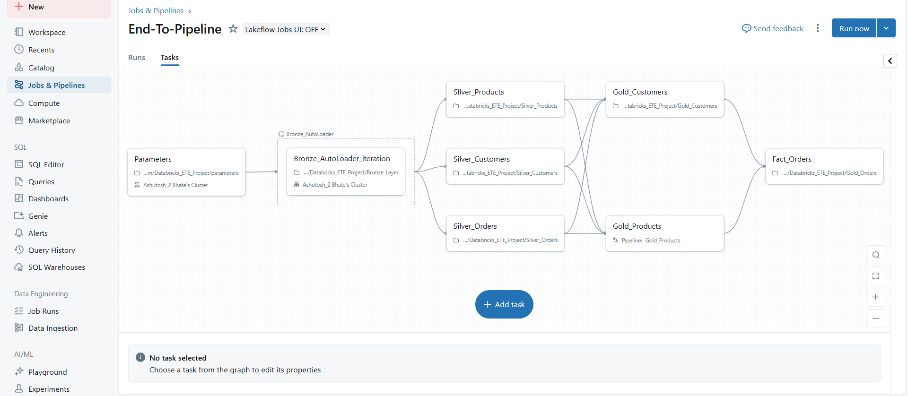
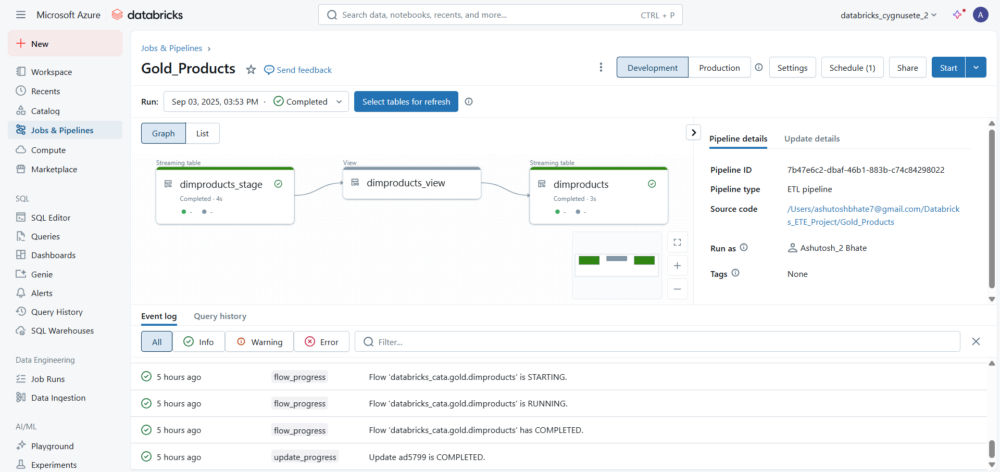
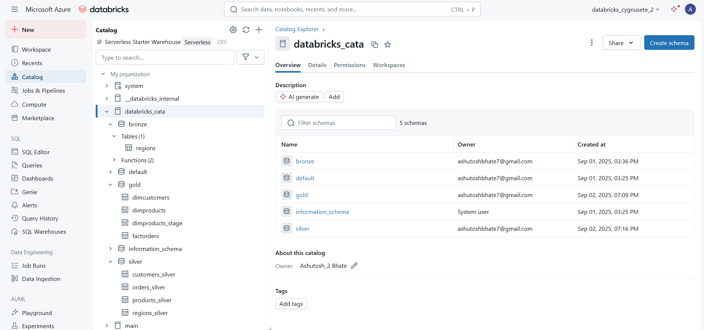

# End-to-End Data Engineering Pipeline on Azure Databricks

## Project Overview

This project demonstrates a complete, end-to-end data engineering pipeline built on the Azure cloud platform using Azure Databricks. It ingests raw transactional data, processes it through a multi-layered **Medallion Architecture** (Bronze, Silver, Gold), and models it into a **Star Schema** optimized for analytics.

The pipeline leverages modern data engineering practices, including incremental data loading with **Spark Structured Streaming** and **Autoloader**, implementation of **Slowly Changing Dimensions (SCD Type 1 & 2)**, and automated workflow orchestration using **Databricks Jobs**.

---

## Technology Stack

* **Cloud Platform**: Microsoft Azure
* **Data Lake**: Azure Data Lake Storage (ADLS) Gen2
* **Processing Engine**: Azure Databricks, Apache Spark (PySpark)
* **Data Format**: Delta Lake
* **Ingestion**: Databricks Autoloader, Spark Structured Streaming
* **Orchestration**: Databricks Jobs, Delta Live Tables
* **Governance**: Unity Catalog

---

## Architecture Diagram

The entire pipeline is orchestrated within Azure Databricks, reading from and writing to ADLS Gen2. The flow follows the Bronze-Silver-Gold paradigm to progressively refine the data into a Star Schema.

---

## Key Features

* **Medallion Architecture**: Segregates data into Bronze (raw), Silver (cleaned), and Gold (aggregated) layers.
* **Incremental Ingestion**: Uses Autoloader to efficiently process only new data, avoiding full re-scans.
* **Slowly Changing Dimensions**: Implements SCD Type 1 (overwrite) and Type 2 (historical tracking) for dimension tables.
* **Star Schema Modeling**: Creates optimized dimension and fact tables in the Gold layer for fast analytical queries.
* **Automated Orchestration**: Utilizes Databricks Jobs to define dependencies and automate the end-to-end workflow.
* **Schema Enforcement & Evolution**: Leverages Delta Lake's capabilities to ensure data quality and handle schema changes over time.

---

## Pipeline in Action

Here are some snapshots of the key components of the project running in Databricks.

**1. End-to-End Job Orchestration**
*This image shows the directed acyclic graph (DAG) of the entire pipeline, with tasks for each layer and their dependencies.*

**2. Delta Live Tables (DLT) Pipeline**
*This is an example of a DLT pipeline graph used for developing the Gold layer tables.*

**3. Final Star Schema in Catalog Explorer**
*The final dimension and fact tables are registered in Unity Catalog and ready for consumption.*

